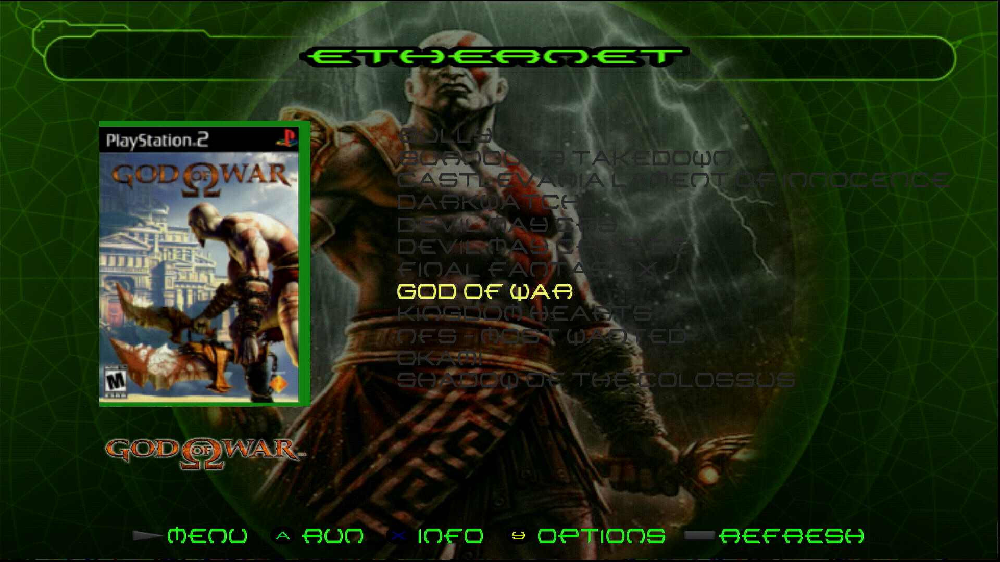
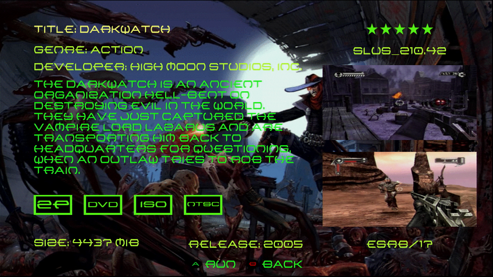

# XBOriginalDash OPL Theme

First attempt at making a custom theme for OPL, inspired by the look of the original Xbox dashboard.

OPL v1.2.0/v1.1.0 with a widescreen monitor (at 1080i) were used, unsure if it works properly on anything else (other OPL versions might have the Elf Loader Menu which may be incompatible/look different, see: https://www.ps2-home.com/forum/viewtopic.php?t=4011).

The APPS (current build) and POPS (deprecated) tabs are both renamed to PS1, because let's be honest what else is it being used for

Original Xbox menu sound effects and ambience are likely trademarked so they can't be put here, but you can follow https://www.ps2-home.com/forum/viewtopic.php?t=6857 to get your own custom sfx.

<h2>Screenshots</h2>

<h2>How to Use</h2>

In your OPL /THM/ directory, copy over the entire /thm_XBOriginalDash/ folder. Reload OPL, select the theme from the display settings and save. The /THM/ folder can be located at the root of any of your connected partitions that load games (HDD, SMB share, USB, etc.).

<h2>Credits</h2>

I don't own the Xbox dashboard or font.

Credits to https://consoledash.com/ for the original image of the xbox dashboard.

The custom menu icons and transparent dashboard were created/edited in GIMP.

Font license: XBOX Original © Lyric West. 2020. All Rights Reserved. From https://online-fonts.com/fonts/xbox-original.

<h2>TODO:</h2>

[ ] - Add placeholder for menu game art, and clean up the spine overlay

[ ] - Add disc art to game list

[ ] - Add aspect ratio to the info screen